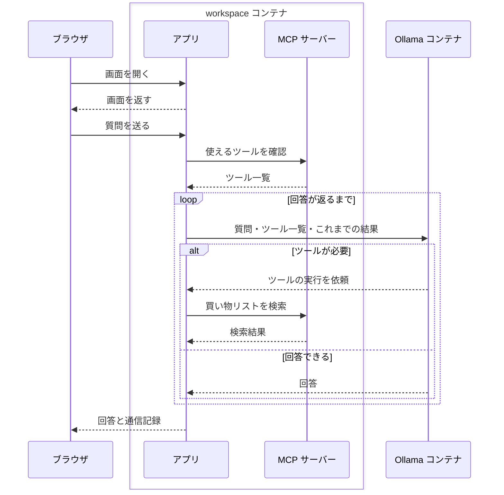

## ollama コンテナ

```sh
ollama list
ollama pull gemma4:e2b  # 初回のみ
```

## workspace コンテナ

```sh
python app.py
```

## 全体の流れ


```mermaid
sequenceDiagram
    participant Browser as ブラウザ
    box workspace コンテナ
        participant App as アプリ
        participant MCP as MCP サーバー
    end
    participant Ollama as Ollama コンテナ

    Browser->>App: 画面を開く
    App-->>Browser: 画面を返す
    Browser->>App: 質問を送る
    App->>MCP: 使えるツールを確認
    MCP-->>App: ツール一覧
    loop 回答が返るまで
        App->>Ollama: 質問・ツール一覧・これまでの結果
        alt ツールが必要
            Ollama-->>App: ツールの実行を依頼
            App->>MCP: 買い物リストを検索
            MCP-->>App: 検索結果
        else 回答できる
            Ollama-->>App: 回答
        end
    end
    App-->>Browser: 回答と通信記録
```
